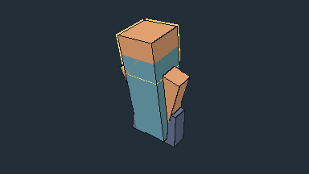
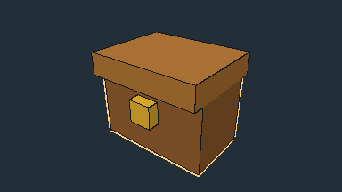
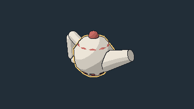

# つみき - Tsumiki Modeler

> ドット絵の3Dモデラー ／ A pixel-art 3D modeler

## これは何か

箱・円柱・円錐台・球・カプセルといったプリミティブと、そこから変換したメッシュを組み合わせて、384×216 という低解像度でドット絵テイストのキャラクターやオブジェクトを作る3Dモデラーです。ブラウザだけで動き、ビルドは不要です。

**まだプロトタイプです。** 一通りの造形・テクスチャ・ボーンアニメーションは動きますが、glTF エクスポートなど未実装の機能があり、UI や仕様は今後も変わります。

## 作例

いずれも本ツールの `render_preview`（MCP経由のレンダリング機能）で撮った、実際の 384×216 描画結果です。作り込み具合はサンプルごとに異なります。

| | | |
|---|---|---|
|  |  |  |
| 人型サンプル | 宝箱サンプル | ティーポットサンプル（球と円錐台で構成） |

## できること

- **形状**: 箱・円柱・円錐台・球・カプセル・メッシュ
- **編集**: 移動・回転・面ハンドルでのリサイズ・複製・左右ミラー
- **メッシュ編集**: 箱や曲面プリミティブからメッシュへの変換、面の押し出し、頂点の移動、パーツの結合、頂点の溶接
- **テクスチャ**: 面ごとの自動UV展開、モデル上への直接ドット打ち（ペン・消しゴム・スポイト）、固定パレット
- **ボーンとFKアニメーション**: ボーンの親子階層、パーツの剛体割り当て、キーフレームとタイムライン、回転はQuaternionのslerpで補間
- **描画**: 384×216固定＋整数倍拡大（端数は黒帯）、3段階トゥーンシェーディング、深度＋法線のエッジ検出による1pxアウトライン（選択パーツは黄色の輪郭を追加表示）
- **保存**: JSONでの保存・読込
- **MCP対応**: AIエージェントからモデルの取得・コマンド適用・検証・384×216プレビュー取得ができます。詳細は [mcp/README.md](mcp/README.md) を参照してください

今後の課題として、glTF エクスポートは未実装です。

## 使い方

このディレクトリで以下を実行し、`http://localhost:8000/` を開きます。

```sh
python3 -m http.server 8000
```

Three.js 0.169.0 を CDN から読み込むため、インターネット接続とWebGL対応ブラウザが必要です。GitHub Pages にはファイルをそのまま配置できます。

マウス操作は Three.js の OrbitControls です。左ドラッグで回転、ホイールでズーム、右ドラッグでパンします。

### キーバインド

| キー | 動作 |
|---|---|
| `W` | 移動モードにする（ボーンモード中はボーンの移動ツール） |
| `E` | 回転モードにする（ボーン／アニメーションモード中は回転ツール） |
| `R` | リサイズモードにする |
| `P` | ペイントモードにする |
| `B` | ボーンモードを切り替える |
| `A` | アニメーションモードを切り替える |
| `F` | メッシュ編集モード（面選択）にする |
| `1` / `2` | メッシュ編集モード中、頂点サブモード／面サブモードを切り替える |
| `Ctrl`/`Cmd` + `D` | 選択パーツを複製する |
| `Space` | アニメーションモード中、再生・停止を切り替える |

複製・左右ミラー・削除・結合・溶接・メッシュ変換・Undo/Redo はツールバーのボタンから操作します（キーバインドはありません）。

## 設計の考え方

- **ModelDoc**（1つのJSON）が唯一の真実で、Three.js のシーンはその派生物です。逆方向には状態を持ちません
- **すべての編集はコマンド経由**で行われます。これが Undo/Redo と MCP 対応の土台になっています
- 座標と寸法は**整数グリッド**単位です
- 拡大は必ず**整数倍**で、端数は黒帯（レターボックス）で埋めます

## 技術構成

ビルドツールなしの素の HTML + ES Modules で、Three.js は CDN（jsdelivr）から importmap で読み込みます。Node.js は MCPサーバーとテスト実行にのみ使用します。

## 開発の記録

- [docs/作業計画.md](docs/作業計画.md): 段階計画と設計判断
- [docs/開発ログ.md](docs/開発ログ.md): 実装の経緯

## ライセンス

[MIT License](LICENSE)

---

© URARA-works
